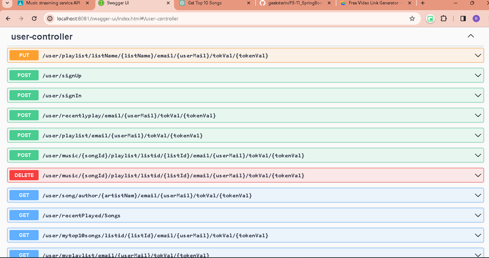
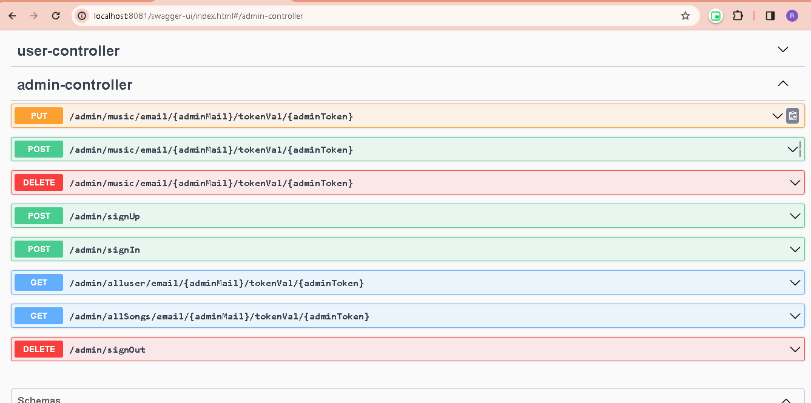

# README

[](https://scrutinizer-ci.com/g/owncloud/music/)


# Overview 

In this overview, we'll discuss the development of a basic music streaming backend application using the Spring Boot framework. We will also incorporate MD5 token authentication for user access, ensuring the security of your application. The MD5 token will be sent to the user's email address as a means of authentication.

### Technologies Used

1. **Spring Boot:** This framework simplifies the development of Java-based applications, making it an ideal choice for building our backend.

2. **MD5:** The MD5 (Message Digest 5) algorithm is used for generating secure, fixed-size hash codes. We'll use it to create authentication tokens for users.

3. **Email Service:** We will integrate an email service to send authentication tokens to users.

### Key Components of the Application

1. **User Authentication:**
   - Users will sign up for the application using their email and a password.
   - Upon successful registration, the application will generate an MD5 token for each user.
   - This token will be sent to the user's email address for authentication.

2. **Music Metadata Database:**
   - We will have a database to store music metadata, including information such as song titles, artists, genres, and album information.

3. **Streaming Endpoints:**
   - Users will have access to endpoints for streaming music, searching for tracks, and managing their playlists.

4. **Security and Authorization:**
   - Requests to streaming endpoints will require a valid MD5 token for access.
   - We will implement security measures to ensure that only authenticated users can access the music streaming functionality.

5. **Email Service Integration:**
   - An email service will be integrated to send MD5 tokens to users upon registration.
   - Users will need to verify their email addresses to activate their accounts.

### Application Flow

1. User Registration:
   - Users will create accounts by providing an email and password.
   - Upon successful registration, an MD5 token will be generated and stored in the user's profile.

2. Email Verification:
   - An email will be sent to the user's email address with the MD5 token.
   - The user will need to click on a verification link to activate their account.

3. Music Streaming:
   - Once authenticated, users can access music streaming endpoints.
   - These endpoints will fetch music data from the database and serve it to the users.

### Security and Scalability

- Spring Boot provides built-in security features to protect your application from common security vulnerabilities.
- As your user base grows, you can scale the application horizontally by adding more instances or leveraging cloud-based services for database and email delivery.


#  Frameworks and language Used

  * SpringBoot
  * Spring MVC 
  * Spring Data JPA
  * MySQL Database
  * Maven Build Tool
  * Core Java 17
  * Postman
  * Swagger

  

## API

The Music app back-end implements the [Rohit API]() except the resources `/artists/<int:artist_id>/shows`, `/tracks/<int:track_id>/lyrics` and the meta resources. You can use this API under '' .

### User Controller API



### Admin Controller Api




However, the front-end of the Music app nowadays doesn't use any part of the Rohit API. Instead, the following proprietary REST endpoints are used:

* `/user/signUp`
* `/user/SignIn`
* `/user/SignOut`
* `/user//playlist/email/{userMail}/tokVal/{tokenVal}`
* `/user/folders/playlist/listName/{listName}/email/{userMail}/tokVal/{tokenVal}`
* `/user//playlist/listid/{listId}/email/{userMail}/tokVal/{tokenVal}`
* `/user//music/{songId}/playlist/listid/{listId}/email/{userMail}/tokVal/{tokenVal}`
* `/user//music/{songId}/playlist/listid/{listId}/email/{userMail}/tokVal/{tokenVal}`
* `/user/file/{fileId}/details`
* `/user/scanstate`
* `/user//music/{songId}/playlist/listid/{listId}/email/{userMail}/tokVal/{tokenVal}`
* `/user//myplaylist/email/{userMail}/tokVal/{tokenVal}`
* `/user/cover/{hash}`
* `/user/artist/{artistId}`
* `/user/artist/{artistId}/details`
* `/user/artist/{artistId}/similar`
* `/user//song/author/{artistNam}/email/{userMail}/tokVal/{tokenVal}`
* `/admin//music/email/{adminMail}/tokenVal/{adminToken}`
* `/admin//allSongs/email/{adminMail}/tokenVal/{adminToken}`
* `/admin/allusers/email/{adminMail}/tokenVal/{adminToken}`

* Playlist API at `/user/playlists/*`
* Radio API at `/user/radio/*`
* Recent View API at `/user/recentPlays/*`

To connect external client applications, partial implementations of the following APIs are available:

* [Music API](https://github.com/ampache/ampache/wiki/XML-methods) at `/ampache/server/xml.server.php`


### `/api/log`

Allows to log a message to ownCloud defined log system.

	POST /user/signUp

Response:

	{
		"message": "User Registered!!"
	}


### `/api/collection`

Returns all playlist with nested songs and each songs with nested tracks. Each track carries a file ID which can be used to obtain the file path with `/user/userId/{userId}/playlist`.

	GET /user/playlist

Response:

	[
		{
			"id": 2,
			"name": "Blind Guardian",
			"Songs": [
				{	"id":1,
					"name": "Nightfall in Middle-Earth",
					"cover": "/index.php/apps/music/api/album/16/cover",
					"id": 16,
					"tracks": [
						{
							"title": "A Dark Passage",
							"number": 21,
							"artistId": 2,
							"id": 202
						},
						{
							"title": "Battle of Sudden Flame",
							"number": 12,
							"artistId": 2,
							"id": 212
						}
					]
				}
			]
		},
		{
			"id": 3,
			"name": "blink-182",
			"albums": [
				{
					"name": "Stay Together for the Kids",
					"cover": "/index.php/apps/music/api/album/22/cover",
					"id": 22,
					"tracks": [
						{
							"title": "Stay Together for the Kids",
							"number": 1,
							"artistId": 3,
							"id": 243
						},
						{
							"title": "The Rock Show (live)",
							"number": 2,
							"artistId": 3,
							"id": 244
						}
					]
				}
			]
		}
	]

### Creating token fo Users

The endpoint `/user/signIn` may be used to programatically generate a random password to be used with an UUID or a MD5 digest. The endpoint expects two parameters, `userMail` and `UserPass`  and returns a JSON response.
Please note that the minimum password length is 10 characters. The HTTP return codes represent also the status of the request.

```
POST /user/signIn/mail/{userMail}/pass/{userPass}/
```

Parameters:

```
{
	"userMail": rohit@gmail.com,
	"userPass": Rohit@999
}
```

Response (success):

```
HTTP/1.1 200 Created

{
	User Otp/Token sent Successfully !
}
```

Response (error - no description provided):

```
HTTP/1.1 400 Bad request

{
	"message": ""
}
```

Response (error - error while generating password):

```
HTTP/1.1 500 Internal Server Error

{
	"message": "Invalid credentials"
}
```


#  Data Flow

   * Controller -

     it Will receive request from client and send request to service layer.

   * Service -

     it Will receive request from controller and this will manipulate the operation and send send request to DAO layer

   * Repository -

     it Will receive request from service and it will communicate with the Database.

   * DataBase Design -

     For Database i am using MySQL and created a pogo for user management where i performing CRUD 
     operation with user basic information.
 
#  Data Structure used in project
 
   * DataBase Design -

     In this project mostly used ArrayList & along with java 8 feature like optional class and 
     lambda expression. 


#  Project Summary
    
   
   * In Music Streaming Service i created a Rest APIs with the help of spring boot where we can perform
    CRUD operation with the user information.
   * Building a basic music streaming backend application with Spring Boot and MD5 token authentication is a great way to get started in the world of web application development. This overview provides a high-level understanding of the key components and flow of the application, focusing on user authentication and secure music streaming. You can further enhance and expand the application with additional features and optimizations as needed. 
